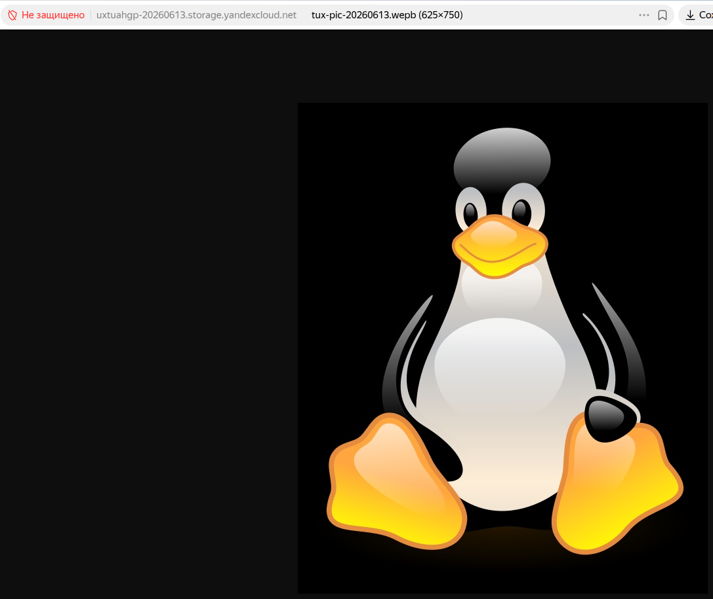
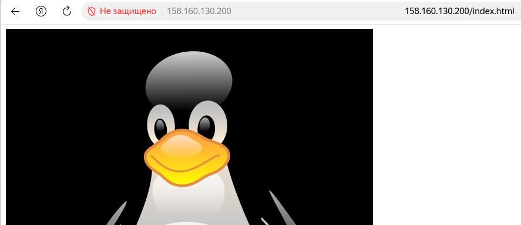
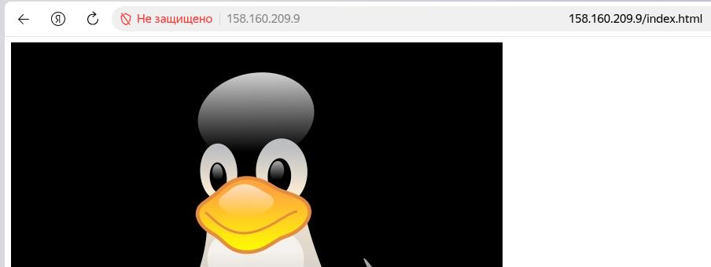

## Практическая работа по теме "Балансировщики нагрузки"

1. С помощью [манифестов terraform](tf/main.tf) :

- создал bucket в объектном хранилище
- загрузил в бакет файл с изображением с локальной машины и сделал его доступным из интернет для всех  
  

2. Развернул группу инстанций ВМ типа LAMP:

- Сделал простейший файл [index.html](tf/index.html) демонстрирующий картинку из объектного хранилища и закодировал его с помощью base64 для передачи через user-data

```
$ base64 < index.html
PGltZwogICAgc3JjPSJodHRwOi8vdXh0dWFoZ3AtMjAyNjA2MTMuc3RvcmFnZS55YW5kZXhjbG91
ZC5uZXQvdHV4LXBpYy0yMDI2MDYxMy5qcGciCi8+Cg==
```

- Добавил в манифест создание сервисного аккаунта и дал для него права на фолдер, в котором разворачиваю приложение
- Добавил в манифест создание группы инстанций и передал через user-data содержимое файла index.html
- Применил конфигурацию
- Проверил доступность моего документа через один из серверов группы
  
- при запуске группы инстанций возникала проблема с отсутствием прав на подсеть - была введена задержка для распространения прав и зависимость для подавления проблемы
- так же была проблема с превышением квоты на количество созданных публичных IP за отрезок времени - на инстанциях выставлено nat = false, доступность решается через сетевой балансировщик

3. Настроил сетевой балансировщик нагрузки

- добавил в манифест ресурс yandex_lb_network_load_balancer
- после применения получил работающую instance group и network load balancer
  
- проверил доступность инстанций обращением по адресу балансировщика
  
- после удаления 2-х ВМ
  - картинка по прежнему одается через адрес балансировщика
  - в целевой группе отразилась недоступность двух инстанций
  - группа инстанций пересоздала автоматически 2 ВМ
    !{Процесс пересоздания инстанций}(redeploy.jpg)
